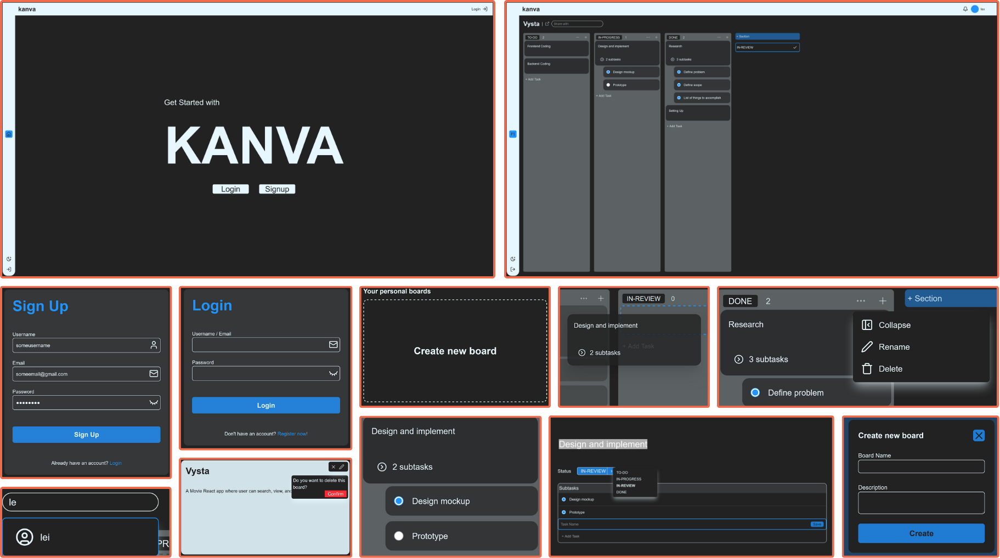
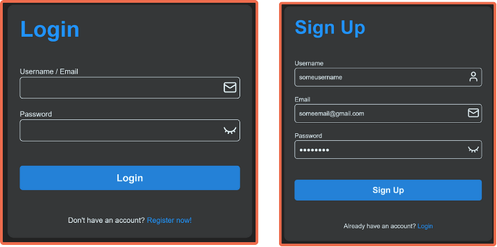
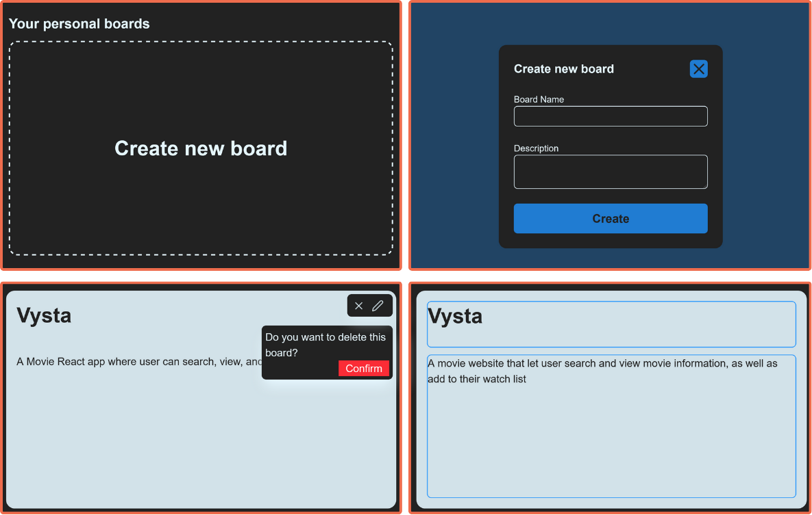
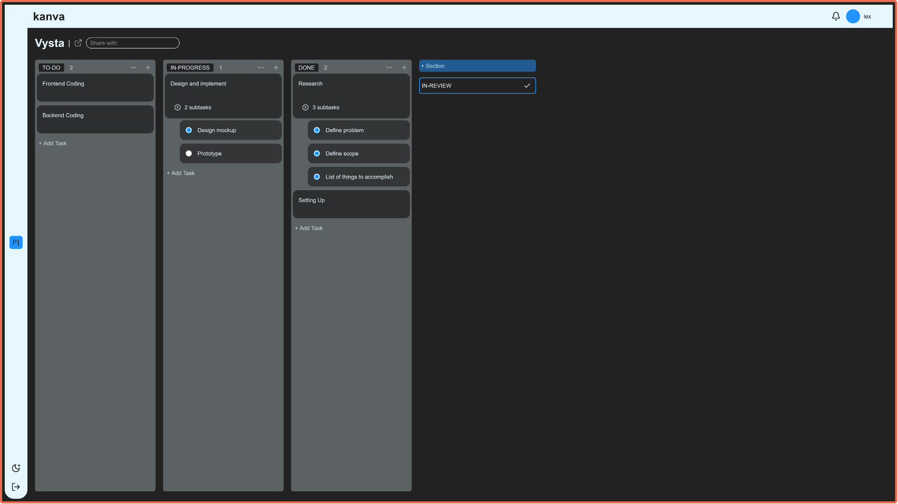
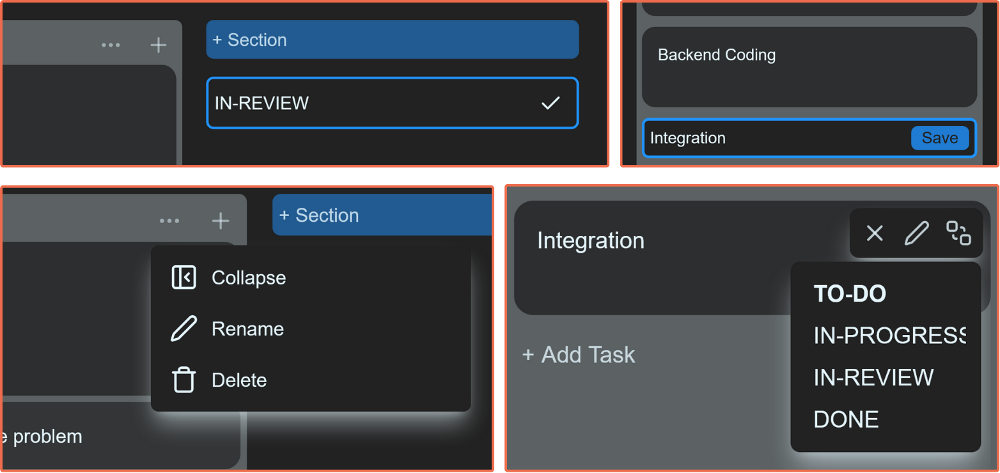
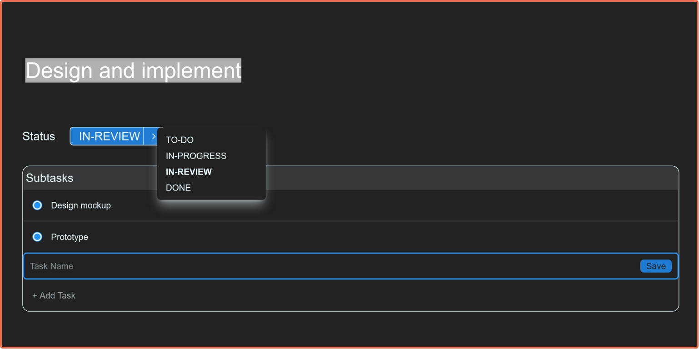
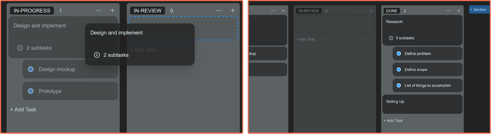
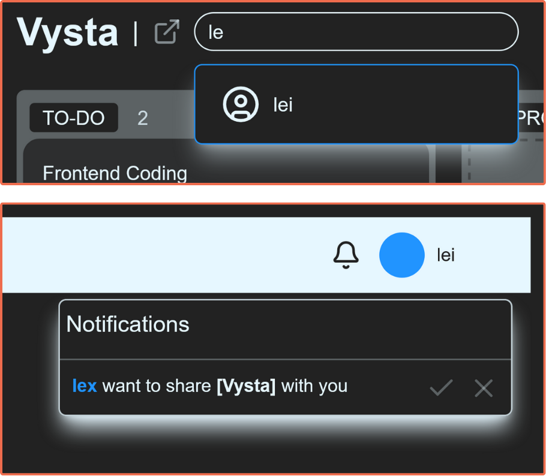

# 🎯 Kanva

**A modern, collaborative Kanban Board web application built with React, Node.js, and MongoDB**

A collaborative Kanban Board web app built with React, Node.js, and MongoDB. Users can sign up, create and manage multiple project boards with drag-and-drop functionality.

---

## ✨ Features

### 🔐 **User Authentication**
Simple user registration and login system. Create an account to save your boards and access them later.

---

### 📋 **Board Archive & Management**
Complete board lifecycle management with controls for creating, organizing, and maintaining your project boards.

**Functions include:**
- **Create** new boards with custom names
- **Rename** existing boards on the fly  
- **Delete** boards with confirmation prompts
- **Archive** boards for future reference

---

### 🎨 **Interactive Kanban Board**
Clean, responsive Kanban interface that adapts to your workflow needs. With customizable columns and real-time updates.

---

### 📝 **Section and Task Management**
Comprehensive task organization with flexible section management and task operations.

**Section Functions:**
- **Create** custom sections (To Do, In Progress, Done, etc.)
- **Rename** sections to match your workflow
- **Delete** sections with task migration options
- **Collapse/Expand** sections for better organization
- **Move** sections to reorder your workflow

**Task Functions:**
- **Create** tasks with titles and descriptions
- **Edit** task details inline
- **Delete** tasks with confirmation
- **Move** tasks between sections

---

### 🔍 **Task Details Viewer**
Comprehensive task management modal with advanced features for detailed project tracking.

**Key Features:**
- **Rename** tasks with rich text editing
- **Move** tasks to any section across the board
- **Create checklists** for step-by-step tracking

---

### 🖱️ **Drag and Drop Functionality**
Intuitive drag-and-drop interface for effortless task and section management.

**Capabilities:**
- **Drag tasks** between sections seamlessly
- **Reorder tasks** within sections
- **Move sections** to reorganize your workflow
- **Auto-save** changes in real-time

---

### 👥 **Team Collaboration**
Invite team members to collaborate on your boards, send invitation using their username.

---

### 🚀 Access the app here:
https://kanva-xbv4.onrender.com

